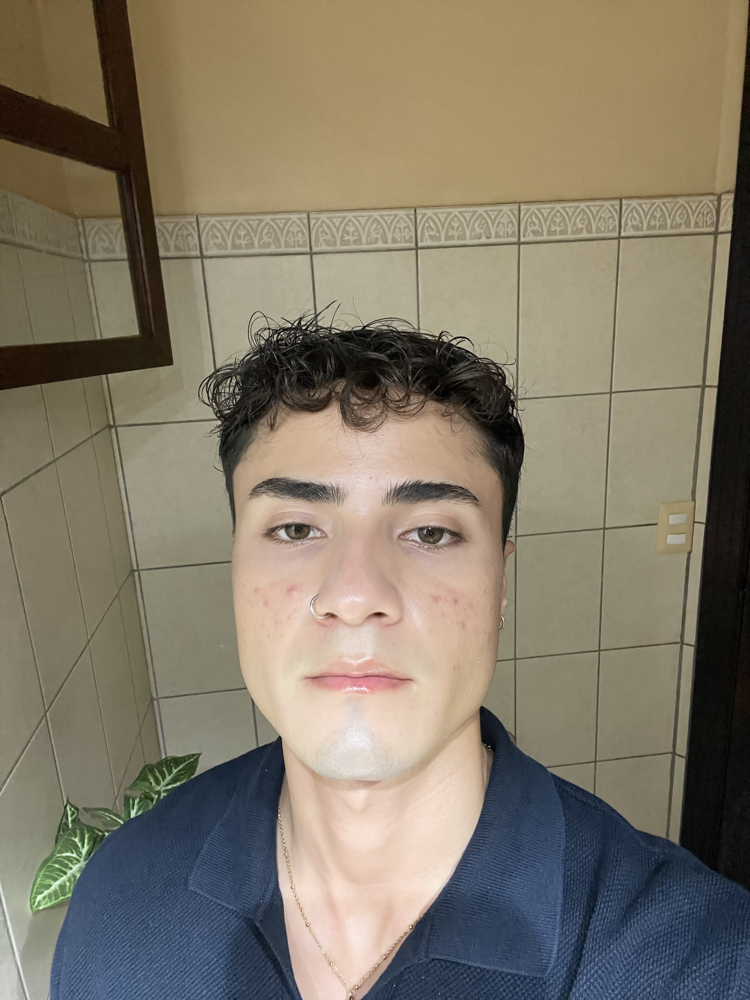

# Hi there! Welcome to Eduardo's README 🤩
### ✨My name is:
Eduardo Solís *(my full name is a lot longer than this, but we are keeping it short for today)*.

---
### 🧠*Reasons why I love Neuroscience*:
- It offers a wide range of career possibilities, including med school, lab research, and even career in speech therapy!
- It is a field full of questions waiting for *me* to uncover the answers.🤩

### 🖥*Why am I interested in NESC 3505?*:
- As a third-year Neuroscience student interested in pursuing Honours, I realized I lack the necessary skills for managing and analyzing the data that will come with conducting my own research.
- After investigating about this course and stumbling upon the textbook, I learned about how the skills gained in this class will help me standout when applying for positions in a lab.

### 🎓*What is next for me after graduation?*:
- The possibilities are truly *endless*! I plan to take a year to travel and spend some time with my family, but after that, I intend to move to Montréal and perhaps pursue a post-graduate program at McGill University. I would like to remain on the path of Neurobiology, as I am interested in researching the role of glial cells in plasticity.

---
### Fun fact about me!
I love to take pictures of things I see/do/like, so I created a VSCO account to have all my favourite pictures in one place. Check it out if you'd like!📸

[Eduardo's VSCO](https://vsco.co/edfs02/gallery)

